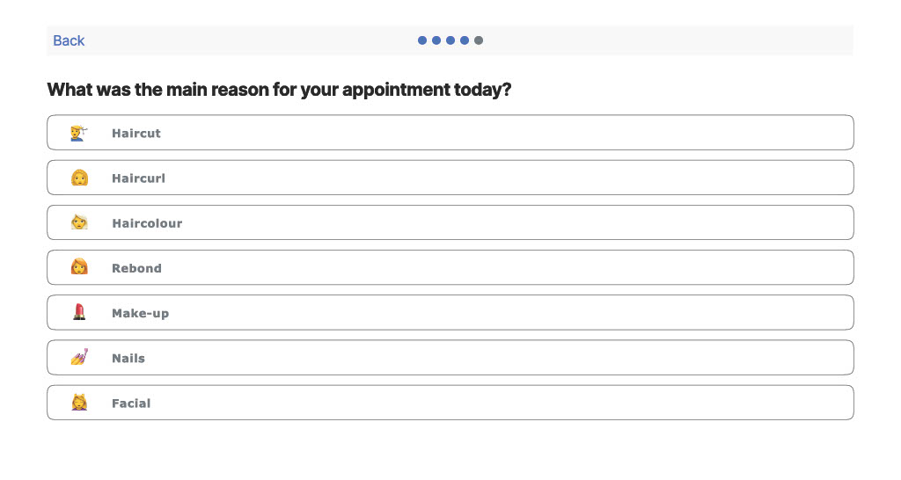
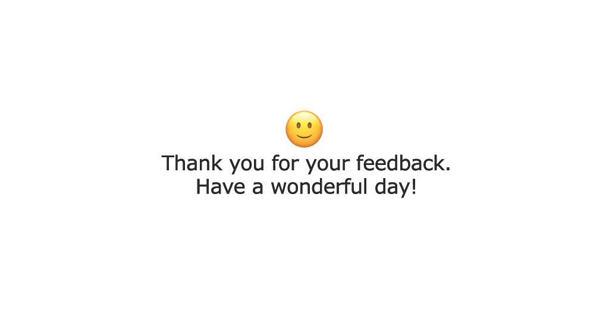

### Current projects

Feedback app (private repository)

The purpose of this project is to develop a simple distributed system to collect client feedback after their appointment. This app targets Samsung Tablet A8 in both landscape or portrait screen. I am using agile delivery with Jira as my prefered software development tools. The code base is in a private repository hosted in BitBucket. I will be happy to share you my code for hiring pourposes.

    Infrastructure: 

     1. Flutter mobile app (pending)

     2. Nest JS API with TypeORM (done)

     3. PostgreSQL (DB and views) (done)

     4. Power BI (dashboard) (done)

---

Trivia night flutter mobile app (private repository)

The purpose of this project is to familiarize myself into a new technology (Flutter) to develop a mobile ready app. This project uses provider package for state management and trivia-api. Current features includes toggle dark mode, sound, and user able to review their score. This is a private repository hosted here in GitHub but I am willing to show the codebase or send the .apk file to employers. 

