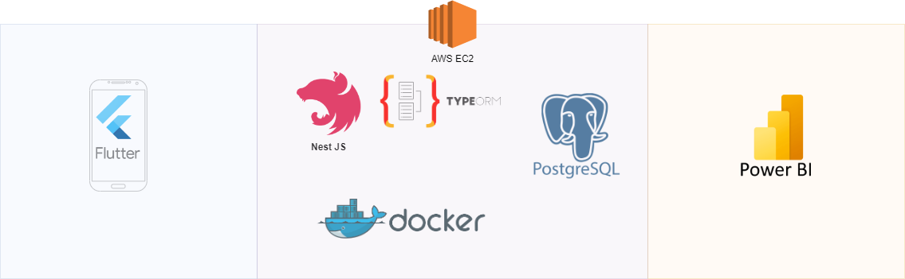
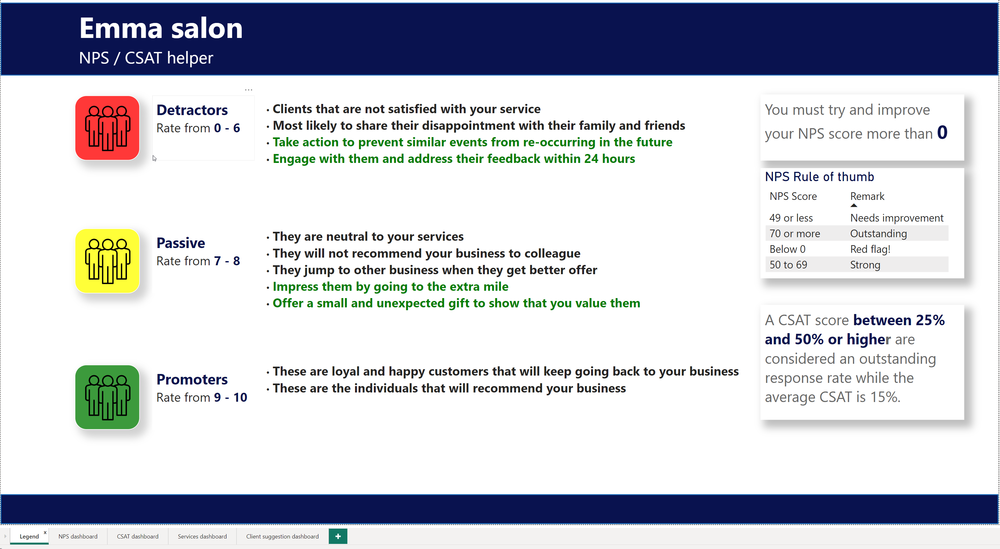
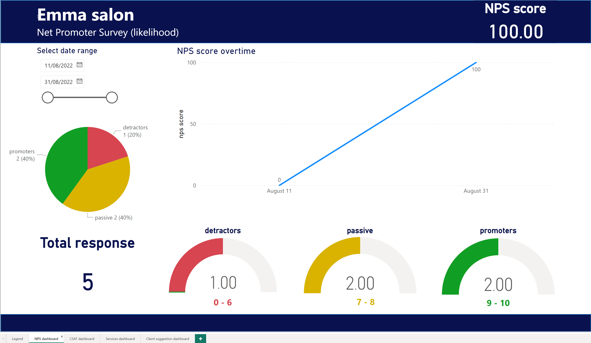
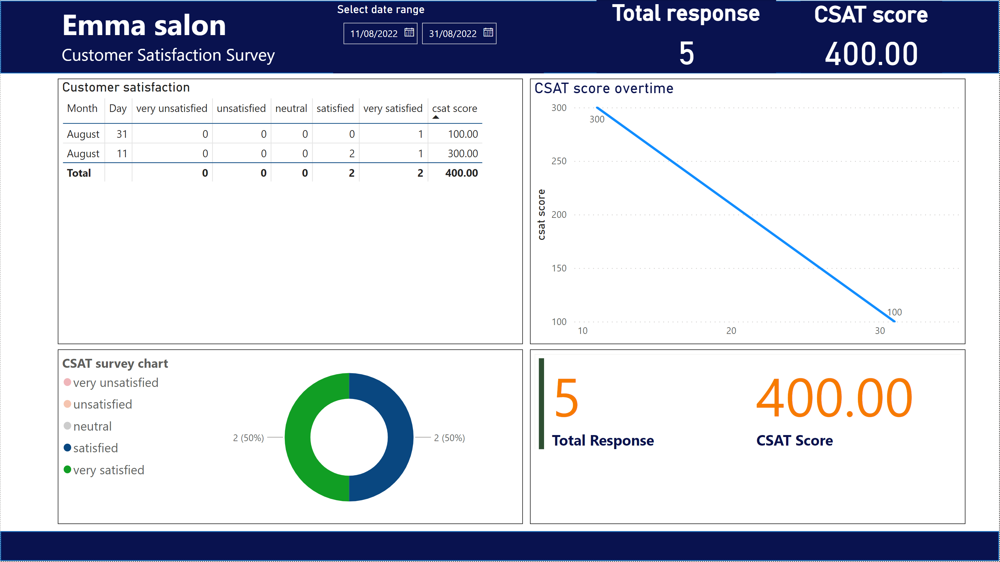
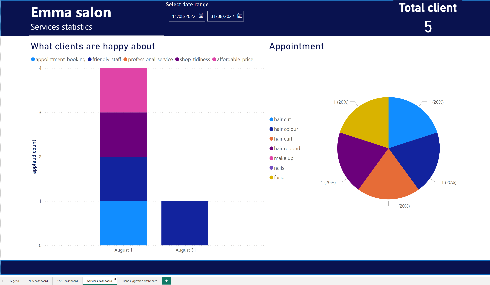

## Current projects

### Feedback app (private repository) Postponed

Developers perspective:

The purpose of this project is to develop a simple distributed system to collect client feedback after their appointment. This app targets Samsung Tablet A8 in both landscape or portrait screen. I am using agile delivery with Jira as my prefered software development tools. The client uses Apple products that is why the prototype is loosely inspired by Apple's Human Interface Guidelines Cupertino.

Clients' perspective:

Measure customer satisfaction and loyalty to improve customer service with the use of NPS and CSAT survey.

#### Architecture

#### BI Reports

#### Client

---

### Trivia night flutter mobile app (private repository) Postponed

The purpose of this project is to familiarize myself into a new technology (Flutter) developing mobile ready app. This project uses provider package for state management and trivia-api. Current features includes toggle dark mode, sound, and user able to review their score. The wireframe was created using Figma and inspired by Material design.

##### Sprint 1: MVP (completed) 🚀

1. Splash screen

2. Category selection screen

3. Difficulty selection screen

4. Number of questions selection screen

5. Question screen

6. Results screen

7. Review answers screen

8. Menu screen

9. Dark mode

10. Toggle background music

11. Reset trivia (app settings, trivia, navigator)

##### Sprint 2 v.1.3.0 features includes(pending):

1. timer mode - system will go to the next question without any user selection

2. offline mode - system allows user to fetch trivia without internet connection

3. user interaction sound effect

4. responsive layout ***

5. Icons for categories label

6. Page transition animation

##### Sprint 3 v.2.0.0 (to do)

Goal: System allows user to create their own trivia(question, answer, and configuration settings. Other players can access the quiz via trivia id.

1. trivia database

2. trivia maker form

3. trivia id generator

4. Adding a new option to play a custom trivia by inputting trivia id in the splash screen
